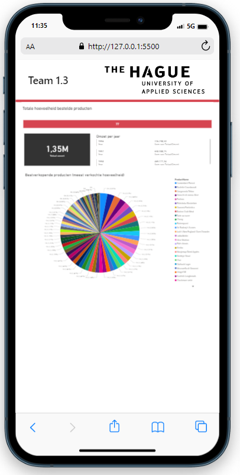
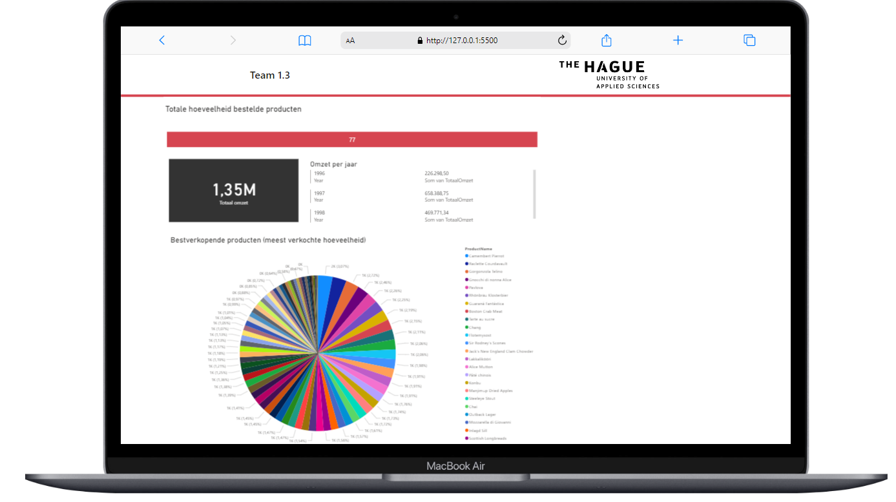

## Data Science project for data analysis
- This project features a web application that has been built using a combination of embedded Power BI, HTML, CSS, and Bootstrap 5. The embedded Power BI functionality allows for advanced data visualization and analysis, while the use of HTML and CSS provides a sleek and modern look and feel. Bootstrap 5 has been utilized to ensure the application is highly responsive and mobile-friendly. Overall, the application is a robust and user-friendly solution for those seeking to gain insights and make informed decisions based on data analysis.

- As a diligent student at The Hague University of Applied Sciences, I am also a proficient software engineer with experience overseeing large-scale programming projects across diverse industries. In addition to my studies, I research and explore innovative ways to teach programming and design to students of all levels. You can find me online under the name "Coder Shiyar"
 
[https://youtube.com/codershiyar]

## Dashboard link
 
[https://codershiyar.github.io/embedded-powerbi]